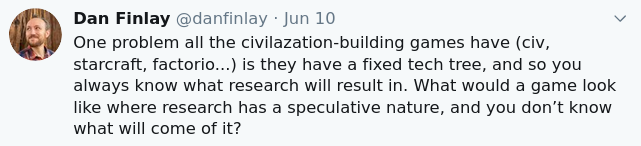

# Scinamic

The beginnings of a strategy game where the tech tree changes on each game, so that research is always a surprising mystery!

Loosely basing these initial thoughts on an RTS like StarCraft.

## Starting Game Components

### Resources

The game could have a fixed set of basic resources, there probably isn't a lot of value in cycling those too much, since everything else could be dynamic, it would be almost incoherent to cycle them too, right? Or why not, at that point? Little is lost, since the players will have little point of reference ;)

### A basic worker unit

We might want some basic yard-stick unit that starts the game, is able to construct buildings, and represents the point of measure against which all other "improvements" are based.

For that reason, we might start by saying its stats are:

- Movement Speed: 1
- Attack: 1
- Vision Range: 1

In addition, this worker would be able to build some set of buildings.

### Initial set of buildings

As soon as buildings are available, it should be clear what they can build. Maybe this part doesn't even need to be dynamic! For example, a building could:

- Allow training more units
- Allow conducting research

### Additional units

When considering which building to build first, the player should be able to at a glance see what that building will _definitely_ make possible. The research tasks may be a crap-shoot, but at the very least we should have a baseline of what units the players could start training from the very start of the game.

This probably means to start the players need a very good "overview" screen, because upon starting they might be learning the entire tech tree from scratch. This would lend itself to a representation of the current tech tree that is very quickly visually parsable, so a quick glance could give a player a sense of what different buildings might make possible at this point.

Since these units would be procedurally generated, there would need to be many ways for them to vary:

- Land/flying
- Size
- Ranged/Melee
- Damage type(s)?
- Armor type(s)?

There would also have to be a large collection of "special powers" that are probably hard-coded but only doled out in response to research. This could be the kind of ever-growing collection of powers that make up a game like League of Legends.

### Research Tasks

Initially, a research task would just have:

- a name
- a cost
- a time to complete

If we wanted to _really_ resemble science, we wouldn't even have a definite duration, we'd just have an indeterminate field that could be funded, and may occasionally yield results.

For the sake of fun, let's say that research tasks always have an upper time limit to yield results, and even if we don't show how long it will take to reach that, we will at least show how much it will cost _per second_ of that type of research.

## What Research Yields

I'm starting a bigger section here, because really this is the core of what would make this game interesting, so I want to make space.

A few stray thoughts to start:

- A research task may make new buildings available to build.
- A research task may make new units available to train.
- A research task may provide upgrades to existing units or structures.
- A building's research may be more likely to provide upgrades to its own units.
- There could be new buildings that are only possible of multiple research tasks are completed, but they too are hidden until available.
- A research task could affect all existing units, or all units of a type, or could make upgrades available for purchase (either globally or per-unit).
- Could a research task allow new units to be trained on a building that isn't even available to build yet? I don't see why not, though it could be frustrating.
- For the above reason, we may actually not want dual-dependency research: ie, we may want a "trie", not a "graph" of research. That would ensure research would always result in immediately visible changes (even if that detracts from the "realism").
- I'm clearly okay making "the innovation" of this game "not knowing the tech tree", and not necessarily going for "scientific realism", even though "getting a little more realistic" was sort-of [the founding thought](https://twitter.com/danfinlay/status/1270902701291757569?s=20).
- If we accept "no dual-dependency" research, then a research task wil _always_ and _only_ affect its own units.
- There may be a way to still allow dual-dependency research, if it requires having two buildings built to even _begin_. This "cross-pollination" type research could yield new buildings and units that might share traits between the two other buildings in a deterministic, crypto-kitty sort of way (that sounds pretty fun tbh, real-time breeding a tech tree in game).

## Current Implementation

Current implementation is pursuing a very MVP approach to this. To that end, I am exploring the following direction:

- There is no distinction between units and buildings.
- There is no initial notion of space, and so any victory or battle conditions will be "aspatial" (like Magic the Gathering, let's say).
- You start with one (deterministically generated) unit, which has three actions on it.
- Each action produces a new (deterministic) type of unit.
- While you may be able to see the immediate stats of the new unit before creating it, you cannot see the results of the new unit's actions that it will come with until you have it.

## Running Script

Currently bundled as ES6, and experimenting with using `deno` as a development runtime. To run, try `deno run src/index.ts`.

Might start as a command-line single-player game.

Knowing me, I'll probably extend the API to the client via [capTP](https://github.com/danfinlay/captp-stream) just to try it out. This means that I will generally try to construct objects in a way that they are:

- Async first
- Ocap-secure (posession of an object implies ownership of control, ie could be passed directly to the player over capTP).

A fun side-effect of this architecture is that it could allow very easily:

- Enabling automating gameplay via API
- Enabling a player to share control of their units with another player or agent.
- Enabling "queueing" actions in series (even in branching conditions), basically for free given the promise pipeline structure.

